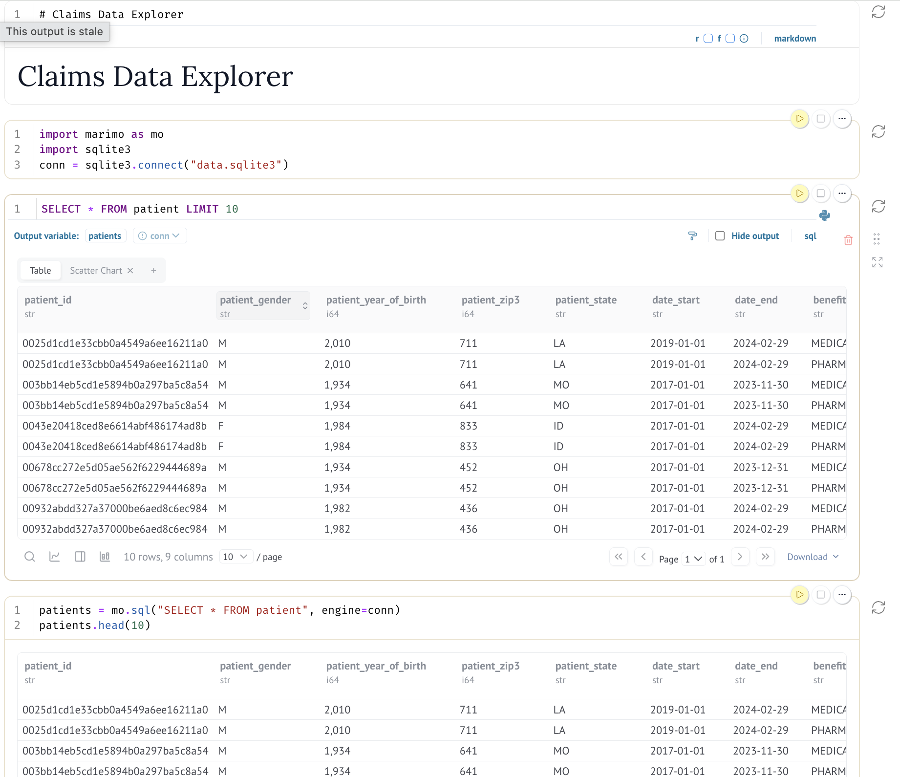

# This repo contains notional claims data that we can use to both tech screen deployment strategists and to practice data pipelining for FDEs / Devs

## What is it

A bunch of csv files that can be joined together. 

#### Available Tables

- `patient`
- `provider`
- `diagnosis`
- `procedure`
- `medical_claim`
- `pharmacy_claim`

### Excel workflow

Open the first CSV in excel or gsheets. Open another CSV in the same excel in a new sheet. Use vlookups to connect the datasets together. 

### SQL workflow

Clone the repo or download from github. Assuming you have python installed, you can write the CSVs into a sqlite db like so:

```bash
uv sync
python3 import_csvs.py
```

This script will:
- Create `data.sqlite3` database (removes existing one if present)
- Import all CSV files as tables: `patient`, `provider`, `diagnosis`, `procedure`, `medical_claim`, `pharmacy_claim`

Now you can query this data in sql. 

```bash
% sqlite3 data.sqlite3
sqlite> SELECT * FROM patient LIMIT 10;
```

### Marimo workflow (SQL and/or Python)

Clone the repo and install dependencies using [uv](https://docs.astral.sh/uv/) and then query in marimo:

```bash
uv sync
source .venv/bin/activate
uv run marimo edit notebook.py
```
## Screenshot


